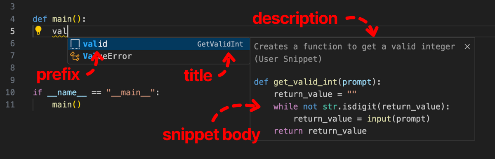

# Your First Snippet

The **Snippets** sidebar view loads all snippets of the current recognized language. Whenever the current active filetype changes, the view updates.

*Already have code to use? Highlight it in your editor.*

## Steps

1. Click the <i className="codicon codicon-plus"></i> in the Snippets title menu to add a global snippet of the current active language
2. Add and modify snippet code in the new code editor
3. Fill out the `title`, `prefix`, and optionally `description` fields in the **Snippet Editor** sidebar view
4. Click `Save`
5. The snippet <i className="codicon codicon-symbol-snippet"></i> will appear in the autocomplete box as you type the `prefix` in your editor. Click it or hit tab to expand the snippet

### Snippet Metadata

- `Title` - the key to store the snippet in the json file. Make it unique.
- `Prefix` - An autocomplete trigger that expands your snippet. You can specify multiple by using comma delimiters.
- `Description` - Gives an description of the snippet that appears in the autocomplete box.

### Tips

- Remove any leading and trailing whitespace newlines, or they will be include as part of the snippet.
- You can edit the snippet later if you want to tweak it.
