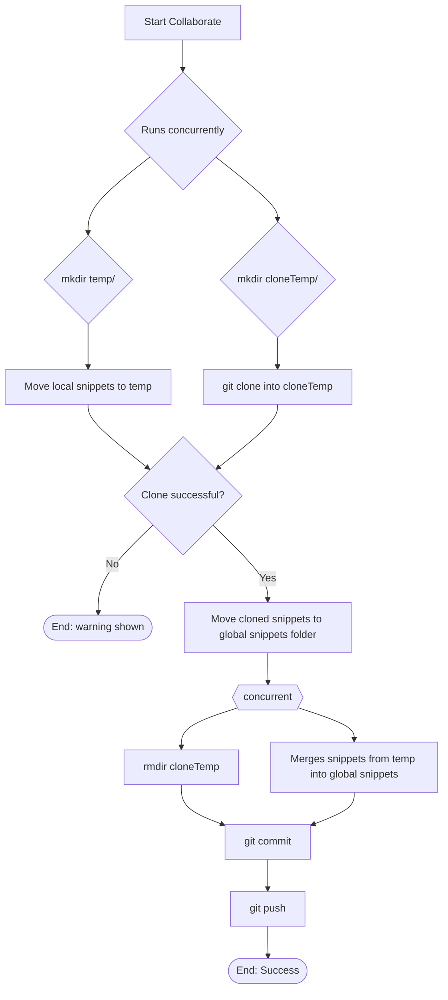

# Collaborate Flow

Flow for **Merge -> Collaborate**: Start with their snippets, merge yours, and set their repository as your remote.

```mermaid
graph TD
    A[Start Collaborate] --> B{Runs concurrently};
    B --> C1{mkdir temp/}
    B --> C2{mkdir cloneTemp/}
    C1 --> D["Move local snippets to temp"];
    C2 --> E["git clone into cloneTemp"];
    D --> F{Clone successful?};
    E --> F;
    F -- No --> G_FAIL([End: warning shown]);
    F -- Yes --> H["Move cloned snippets to global snippets folder"];
    H --> H1{{"concurrent"}};
    H1 --> I[rmdir cloneTemp];
    H1 --> J[Merges snippets from temp into global snippets];
    I --> K[git commit];
    J --> K;
    K --> L[git push];
    L --> M([End: Success]);
```
