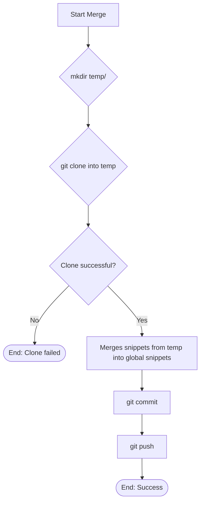

# Merge Flow

Flow for **Merge -> Merge Snippets**: Merge snippets from the remote repository without changing your remote.

```mermaid
graph TD
    A[Start Merge] --> B{mkdir temp/};
    B --> C{git clone into temp};
    C --> D{Clone successful?};
    D -- No --> D_FAIL([End: Clone failed]);
    D -- Yes --> E[Merges snippets from temp into global snippets];
    E --> F[git commit];
    F --> G[git push];
    G --> H([End: Success]);
```
