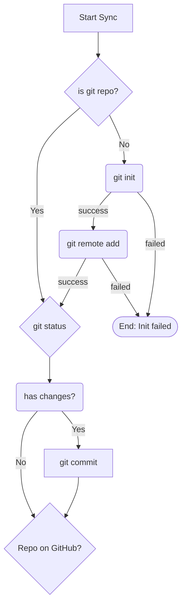
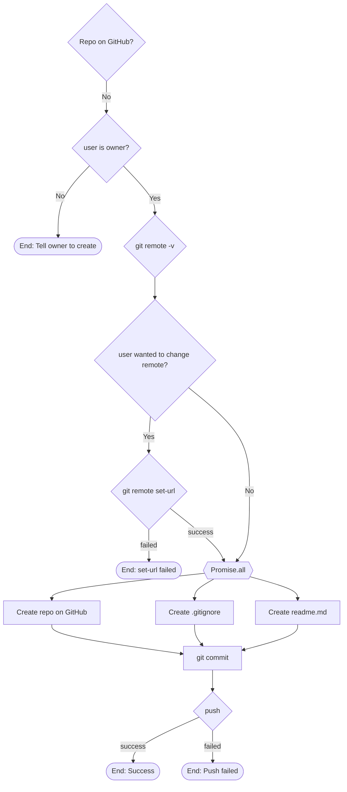
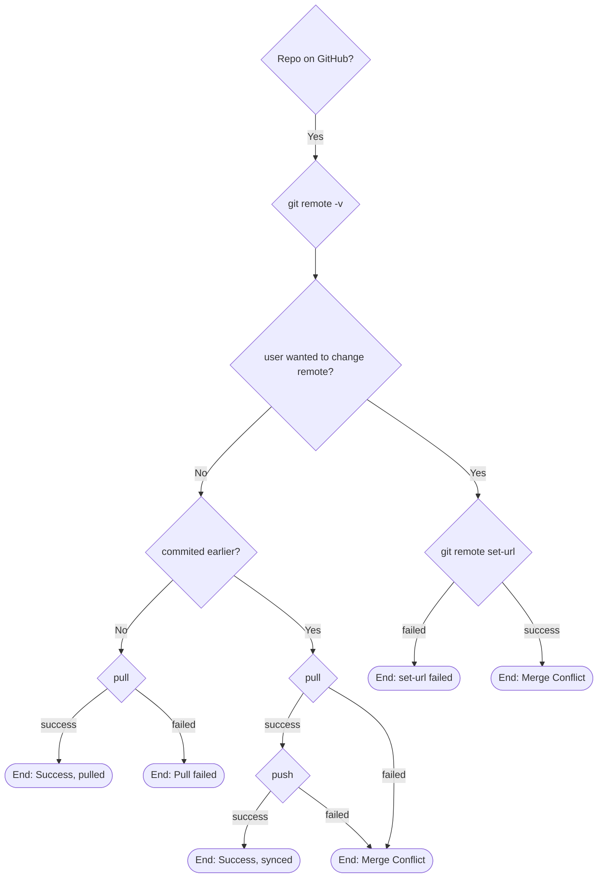

# Sync Flow

Sync Global Snippets uses the following logic to ensure your snippets can make it to GitHub and back.

## Local Git

If yes, jump to [Repo Exists](#repo-exists)

## Repo Doesn't exist

## Repo Exists

### Resolving Conflicts

If there is a merge conflict these final steps are taken to resolve them: 

1. The [collaborate flow](/docs/github-integration/truly-global/collaborate-flow.md) of the Merge Snippet Repo command
2. `git commit`
3. `git push`

Because snippet files are just JavaScript objects, its much easier to perform a *collision-resolving union* of two JS objects instead of come up with a fancy way to resolve git conflicts and run `git merge`. Your commit history will be linear because there is never any branching, rebasing, cherry-picking, or merging (except pull). It really is just committing and pushing
