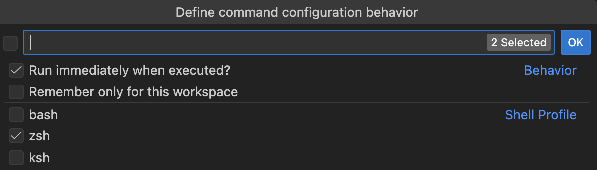

# Shell Snippets

Do you have long commands that you run in the terminal on a regular basis? <i className="codicon codicon-terminal"></i>

## Creating shell snippets

1. Click the <i className="codicon codicon-plus"></i> icon
2. Type the terminal command
3. Customize behavior with additional options

## Options for customization

**Run imediately**: when disabled, you can modify the command before it runs

**Only this workspace**: when enabled, other folders won't include this command

Similar to code snippets, shell workspace snippets are associated with a project and/or collaborators, while global (user) shell snippets are for many different projects.

**Shell Profile**: the kind of terminal to use

The extension will pull from VS Code configuration to know what default shells to suggest and use. Read the VS Code documentation about [terminal profiles](https://code.visualstudio.com/docs/terminal/profiles).
