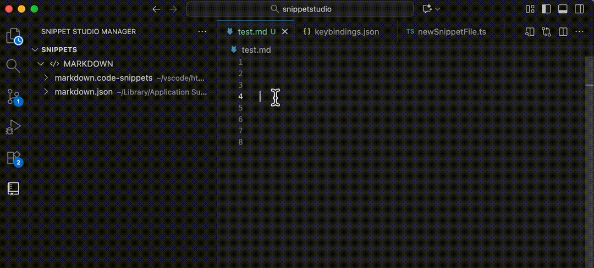

# Keybinding Snippets

SnippetStudio provides a powerful feature to bind your snippets directly to keyboard shortcuts, allowing you to insert them quickly without typing prefixes or using autocomplete. This feature integrates seamlessly with VS Code's native keybinding system.

## How It Works

When you add a keybinding to a snippet, SnippetStudio:

1. **Automatically creates keybinding entries** in your VS Code `keybindings.json` file
2. **Handles language scoping** - the keybinding only works in files matching the snippet's scope
3. **Uses VS Code's native snippet insertion** - leverages the built-in `editor.action.insertSnippet` command
4. **Provides interactive editing** - opens the [keybindings file](https://code.visualstudio.com/docs/configure/keybindings#_advanced-customization) with the placeholder selected for easy customization

## Adding Keybindings to Snippets

1. **Find your snippet** - Navigate to the snippet you want to bind in the snippets view
2. **Right-click the snippet** - This opens the context menu
3. **Select "Add Keybinding"** - Click this option to start the keybinding process
4. **Insert Keybinding** - Replace `INSERT_KEY_BINDING_HERE` with a [keybinding combo](https://code.visualstudio.com/docs/configure/keybindings#_accepted-keys)

## Keybinding Examples

### Slack-Style Link Pasting

Here's a practical example that mimics Slack's link pasting behavior:

```json
{
  "key": "cmd+shift+v",
  "command": "editor.action.insertSnippet",
  "when": "editorTextFocus && (editorLangId == markdown)",
  "args": {
    "snippet": "[${1:$TM_SELECTED_TEXT}](${2:$CLIPBOARD})"
  }
}
```

This keybinding allows you to:
1. Select text in a Markdown file
2. Have a URL in your clipboard  
3. Press `Cmd+Shift+V` (or `Ctrl+Shift+V` on Windows/Linux)
4. Automatically create a markdown link: `[selected text](clipboard URL)`



### Markdown Editor cmd+b to make text bold

We can add to the when clause to make the keybinding more powerful

```json
{
    "key": "cmd+b",
    "command": "editor.action.insertSnippet",
    "when": "editorTextFocus && editor.hasSelection && (editorLangId == markdown)",
    "args": {
        "snippet": "**$TM_SELECTED_TEXT**"
    }
}
```

Add this to your `keybindings.json` if you want a common shortcut to make text bold!

:::tip Best Practices for Key Combinations
- **Avoid common shortcuts** - Don't override essential VS Code shortcuts like `Ctrl+C`, `Ctrl+V`, etc. Check the [default keyboard shortcuts](https://code.visualstudio.com/docs/configure/keybindings#_keyboard-shortcuts-reference) reference.
- **Use modifier keys** - Combine `Ctrl`, `Alt`, and `Shift` to avoid conflicts. See [accepted keys documentation](https://code.visualstudio.com/docs/getstarted/keybindings#_accepted-keys) for valid combinations.
- **Test your shortcuts** - Use the [Keyboard Shortcuts editor](https://code.visualstudio.com/docs/getstarted/keybindings#_keyboard-shortcuts-editor) to check for conflicts with other keybindings.
- **Use memorable combinations** - Choose keys that make sense for your snippet's purpose
- **Consider platform differences** - Some key combinations work differently on different operating systems
:::

## Language Scoping Behavior

The keybinding system respects your snippet's scope configuration:

**Single Language Scope**
```json
// Snippet scope: "typescript"
"when": "editorTextFocus && (editorLangId == typescript)"
```

**Multiple Language Scope**
```json
// Snippet scope: "typescript,javascript,typescriptreact"
"when": "editorTextFocus && (editorLangId == typescript || editorLangId == javascript || editorLangId == typescriptreact)"
```

**Global Scope (.code-snippets files without scope)**
```json
// Works for any language
"when": "editorTextFocus"
```

## Troubleshooting Keybindings

### Keybinding Not Working
1. **Check for conflicts** - Use `Ctrl+Shift+P` → "Preferences: Open Keyboard Shortcuts" to see if your key combination is already used
2. **Verify language scope** - Make sure you're in a file that matches the snippet's language scope
3. **Check syntax** - Ensure the keybinding JSON syntax is correct

### Multiple Snippets with Same Key
If you accidentally assign the same key combination to multiple snippets:
1. **VS Code will show a warning** - Look for keybinding conflict notifications
2. **Last one wins** - The keybinding defined last in the file will take precedence
3. **Update conflicting keys** - Modify one of the key combinations to resolve the conflict

## Technical Details

### What Happens When You Add a Keybinding

When you execute the "Add Keybinding" command, SnippetStudio will:

#### 1. Generate Keybinding Entry
Creates a new entry in your `keybindings.json` file with this structure:

```json
{
  "key": "INSERT_KEY_BINDING_HERE",
  "command": "editor.action.insertSnippet",
  "when": "editorTextFocus && (editorLangId == typescript || editorLangId == javascript)",
  "args": {
    "snippet": "console.log('$1');"
  }
}
```

#### 2. Smart Language Scoping
The [when](https://code.visualstudio.com/docs/configure/keybindings#_when-clause-contexts) condition automatically includes:
- **Editor focus check** - `editorTextFocus` ensures the keybinding only works when editing
- **Language restrictions** - Only activates in files matching the snippet's scope
- **Multiple language support** - Handles comma-separated scopes like `typescript,javascript`

### Profile Awareness
The command respects VS Code profiles:
- **Default Profile**: `~/.vscode/keybindings.json`
- **Named Profiles**: `~/.vscode/profiles/{profileId}/keybindings.json`
