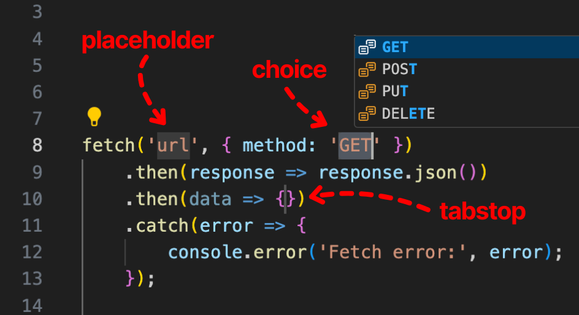
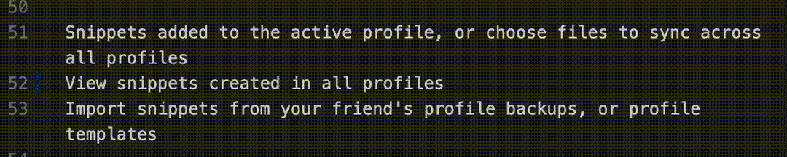

# Snippet Insertion Features

Create _dynamic_ snippets with tabstops, placeholders, and other snippet insertion features

## How they work

Microsoft can [explain it better](https://code.visualstudio.com/docs/editing/userdefinedsnippets#_snippet-syntax)



## Add them to your snippets

There are a few ways to add them. Your curser must be in the snippet editor.

- **Right Click** while in the snippet editor and choose which feature to add
- Use **keyboard shortcuts** while in the snippet editor
- Click the <i className="codicon codicon-ellipsis"></i> three-dot menu at the right of your editor
- Choose one of the commmands below because you love the command prompt
- Type the name of the insertion feature and use the extension-provided <i className="codicon codicon-symbol-event"></i> snippet

### Keyboard Shortcuts

| Insertion Feature               | <i className="fa-brands fa-linux"></i> Linux | <i className="fa-brands fa-apple"></i> Mac | <i className="fa-brands fa-windows"></i> Windows |
| :------------------------------ | :------------------------------------------: | :----------------------------------------: | :----------------------------------------------: |
| Tabstop                         |                `ctrl+shift+1`                |                `cmd+opt+1`                 |                  `alt+shift+1`                   |
| Placeholder                     |                `ctrl+shift+2`                |                `cmd+opt+2`                 |                  `alt+shift+2`                   |
| Choice                          |                `ctrl+shift+3`                |                `cmd+opt+3`                 |                  `alt+shift+3`                   |
| Variable                        |                `ctrl+shift+4`                |                `cmd+opt+4`                 |                  `alt+shift+4`                   |
| Variable with Placeholder       |                `ctrl+shift+5`                |                `cmd+opt+5`                 |                  `alt+shift+5`                   |
| Placeholder with Transformation |                `ctrl+shift+6`                |                `cmd+opt+6`                 |                  `alt+shift+6`                   |

### Commands

- Tabstops: `snippetstudio.editor.insertTabStop`
- Placeholders: `snippetstudio.editor.insertPlaceholder`
- Choices: `snippetstudio.editor.insertChoice`
- Variables: `snippetstudio.editor.insertVariable`
- Variables with Placeholders: `snippetstudio.editor.insertVariablePlaceholder`
- Placeholders with Transformations: `snippetstudio.editor.insertPlaceholderWithTranformation`

## Examples

### Placeholders

- Use multiple tabstop/placeholder numbers to automatically enter mutliline editing
- Use placeholders for default values
- `$0` is where the cursor ends after tabbing through all insertion features


### Regex + Multiline

**Goal:** Fast creation of a [useState](https://react.dev/reference/react/useState) variable hook.

1. Type 'state' as the prefix and hit `tab` to expand
2. Type the name of the variable. ie 'myState'
3. Hit `tab` to move to $2 tabstop. Regex autocapitalizes the 'M' in 'setMyState'
4. Type a default value
5. Hit `tab` to move the cursor to the end of the line

```javascript
const [myState, setMyState] = useState('foo');
```

**Solution:** Use camelcase and pascalcase in [Placeholder Transforms](https://code.visualstudio.com/docs/editing/userdefinedsnippets#_placeholdertransform)

```javascript
const [${1/(.*)/${1:/camelcase}/}, set${1/(.*)/${1:/pascalcase}/}] = useState($2)$0
```

<p className="small">*If you use regex you are cool. Good luck rendering that one, Docusaurus!*</p>

#### Variable Regex

There's also variable transformation with regex. You can read [VS Code's](https://code.visualstudio.com/docs/editing/userdefinedsnippets#_variable-transforms) and [TextMate's](https://macromates.com/textmate/manual/snippets#variables) documentation if you want to better understand it.

```json
"bullit points": {
    "prefix": "bullit",
    "body": [
        "${TM_SELECTED_TEXT/^.+$/- $0/gm}"
    ],
    "description": "add markdown bullets"
}
```


